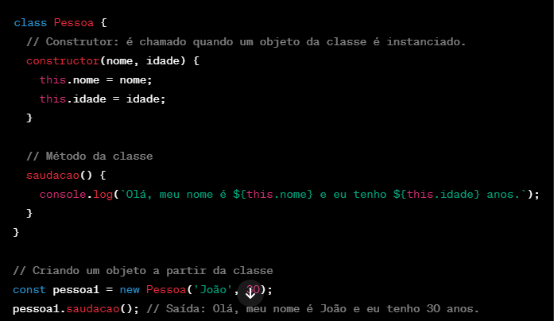

# Criando Classes em JavaScript

Em JavaScript, você pode criar classes usando a sintaxe de classe introduzida no ECMAScript 6 (ES6). Aqui está um exemplo simples de como criar uma classe em JavaScript:

Aqui estão os principais componentes do código acima:**

**class Pessoa { ... }:** Define a classe chamada Pessoa.

**constructor(nome, idade) { ... }:** O construtor é um método especial que é executado quando um objeto da classe é instanciado. Ele é usado para inicializar as propriedades do objeto. Neste exemplo, nome e idade são parâmetros do construtor, e eles são usados para definir as propriedades da instância.

**saudacao() { ... }:** Este é um método da classe que pode ser chamado em objetos da classe. Ele simplesmente imprime uma mensagem de saudação usando as propriedades da instância.

**const pessoa1 = new Pessoa('João', 30);:** Isso cria uma instância da classe Pessoa chamada pessoa1 com os valores 'João' e 30 passados como argumentos para o construtor.

**pessoa1.saudacao();:** Isso chama o método saudacao no objeto pessoa1, que exibe a mensagem de saudação no console.

Você pode criar várias instâncias da classe Pessoa, cada uma com seus próprios valores para nome e `idade. Isso demonstra o conceito de encapsulamento, onde os dados e o comportamento relacionados estão agrupados em um único objeto (uma instância da classe).
